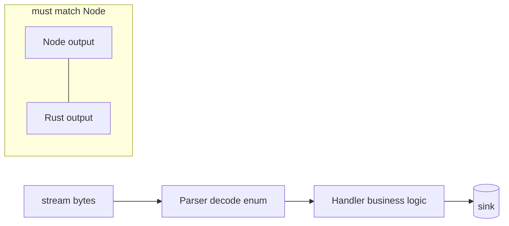

> [!nav] Navigation
> **[[modules/phase-4-backend/04-indexer-rust/Hub|M15 Hub]]** · [[HOME|Home]] · [[learning-progress|Progress]] · [[modules/Index|All modules]] · _you are here: Theory_

# M15 — Indexer Hot Path (Rust / Carbon or Vixen)

**Phase:** 4 | **Prereq:** M14 | **Unlocks:** portfolio proof

## Objectives

- Why rewrite: throughput, memory, single binary deploy
- Carbon or Yellowstone Vixen: parser + handler architecture
- Deserialize with same IDL/discriminators as Node
- Write to Postgres/Kafka from Rust async worker
- Parity test: Rust output === Node output for same tx set

## Visual map

> [!abstract] Draw this first
> Split: parser thin, handler fat.

**Sketch gate:** boxes + where backpressure goes.

## Theory

### Parser vs handler
- **Parser:** bytes → typed `Instruction` enum
- **Handler:** side effects — DB insert, metric

**Numbers:** target hot path <1ms parse, batch insert 100 rows — Node vs Rust measurable on replay file.

### Parity
Golden file: 100 txs JSON from Node export → Rust replay must match.

## Gate

- [ ] G15: Rust consumer processes recorded stream file at 10x realtime
- [ ] Parity test pass
- [ ] R32 L2+

## Weakness: `W-indexer`, `W-async`
