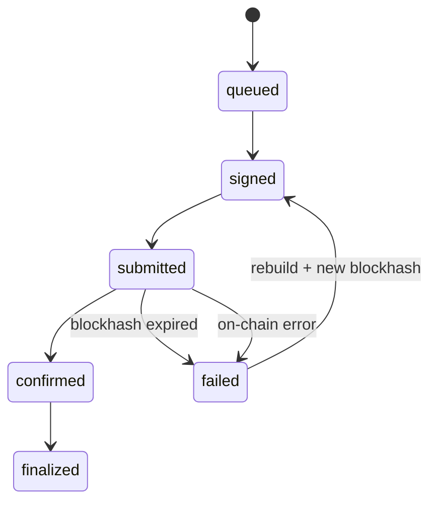

> [!nav] Navigation
> **[[modules/phase-4-backend/05-tx-lifecycle/Hub|M16 Hub]]** · [[HOME|Home]] · [[learning-progress|Progress]] · [[modules/Index|All modules]] · _you are here: Theory_

# M16 — Transaction Lifecycle Service

**Phase:** 4 | **Prereq:** M08, M12 | **Unlocks:** M17

## Objectives

- Build → sign → simulate → submit → confirm pipeline
- Recent blockhash fetch + expiry timer (~60–90s)
- Priority fees / compute budget ix prefix
- Confirmation polling vs subscription (`signatureSubscribe`)
- Idempotent retries: same `client_tx_id`, new blockhash → no double pay
- Durable nonce (advanced optional)
- Status machine: `queued → signed → submitted → confirmed → finalized → failed`

## Visual map

> [!abstract] Draw this first
> State circles. Blockhash = timer on submitted.



```
Idempotency
  intent_id=pay_123 ──► sig_abc (landed?) ──► retry only if not landed
```

**Sketch gate:** state diagram + blockhash TTL clock.

## Theory

### Idempotency
Store `intent_id` + `last_signature`. Retry checks on-chain if prior sig landed.

**Backend map:** outbox + at-least-once worker — you know; blockhash = lease TTL.

### Blockhash expiry
Submit at T+0, blockhash stale at T+70s — rebuild message, re-sign.

**Numbers:** base fee 5000 lamports; priority 10000 micro-lamports/CU × 200k CU = math exercise.

## Gate

- [ ] G16: service submits tx to devnet with retry on expired blockhash (injected)
- [ ] R33 L2+

## Weakness: `W-tx-lifecycle`
