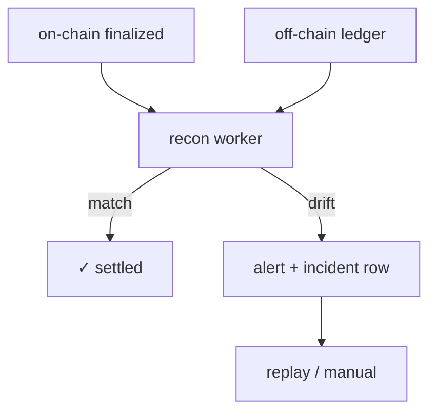

> [!nav] Navigation
> **[[modules/phase-4-backend/06-reconciliation/Hub|M17 Hub]]** · [[HOME|Home]] · [[learning-progress|Progress]] · [[modules/Index|All modules]] · _you are here: Theory_

# M17 — Reconciliation & Drift Detection

**Phase:** 4 | **Prereq:** M14, M16 | **Unlocks:** curriculum complete

## Objectives

- Index token transfers relevant to your ledger
- Off-chain ledger: expected balances / payments
- Reconciliation job: compare on-chain vs off-chain at `finalized`
- Drift types: missing tx, duplicate, amount mismatch, late finality
- Reorg handling at finalized (rare) — alert + manual playbook
- Alerting + audit trail

## Visual map

> [!abstract] Draw this first
> Two ledgers side by side. Drift = red highlight.



```
Every 5 min cron
  watermark slot ──► compare balances ──► |diff| > ε ?
```

**Sketch gate:** G17b capstone — all 3 services in one diagram.

## Theory

### Settlement boundary
Business `SETTLED` only at finalized commitment (or N confirmations policy).

**Numbers:** if 0.01% txs drift and 10k tx/day = 1/day — alert threshold design.

### Reconciliation loop
```
cron every 5m:
  finalized_slot_watermark
  for each user:
    on_chain_balance(program accounts)
    vs sum(ledger entries)
    if |diff| > epsilon → incident
```

**Backend map:** this IS your payments reconciliation — new data source.

## Gate (curriculum capstone)

- [ ] G17: inject intentional drift in test ledger — detector fires <1 run
- [ ] G17b: 2-page architecture: indexer + tx service + reconciliation
- [ ] R34 L2+

## Weakness: combines all
